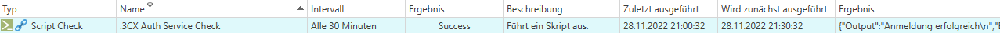

# 3CX Auth Service Check
Dieser Check für die Authentifizierung am 3CX Web Server für alle folgenden Checks durch. Der Check sollte in einem Intervall von 30 Minuten aufgeführt werden.

Im Audit-Log der 3CX erscheint pro Anmeldung ein Eintrag von 127.0.0.1:


Output:


Code:
```bash
#   Herausgeber: aconitas® GmbH - Bäumenheimer Str. 5 - 86690 Mertingen
#   Website: https://www.aconitas.com
#   Telefon: +49(906)126725-0
#   E-Mail: info@aconitas.com
#
#   Version 1.0


########################################################
#### Import Zugangsdaten aus 3CX DB
Password=$(sudo -u postgres psql -d database_single -c "SELECT * FROM parameter where name='WEBSERVERPASS'" | grep WEBSERVERPASS | tr -s ' ' | cut -d ' ' -f 10)
#echo $Password
Username=$(sudo -u postgres psql -d database_single -c "SELECT * FROM parameter where name='WEBSERVERUSER'" | grep WEBSERVERUSER | tr -s ' ' | cut -d ' ' -f 10)
#echo $Username

########################################################
#### Import WebServerPort aus 3CX DB
WEB_SERVER_PORT=$(sudo -u postgres psql -d database_single -c "SELECT * FROM parameter where name='WEB_ROOT_LOCAL'" | grep WEB_ROOT_LOCAL | tr -s ' ' | cut -d ' ' -f7)
WEB_SERVER_PORT=${WEB_SERVER_PORT:7} 

########################################################
#### Export WebServerPort in ConfFile auf 3CX Server
if [[ $WEB_SERVER_PORT =~ ':' ]]; then
 echo $WEB_SERVER_PORT | sed "s|.*:\(.*\)/.*|\\1|" > /tmp/3cx.port
else
 echo 80 > /tmp/3cx.port
fi

########################################################
#### Import WebServerPort in Variable
HTTP_PORT=$(cat /tmp/3cx.port)
#echo $HTTP_PORT

########################################################
#### Authentifizierung an 3CX Web Console
RESULT=$(curl -s --request POST --cookie /tmp/3cxcookie --cookie-jar /tmp/3cxcookie --data "{'username':'$Username','password':'$Password'}" --header "Content-Type: application/json" --output - localhost:${HTTP_PORT}/api/login)

if [[ $RESULT =~ 'AuthSuccess' ]]; then
  echo Anmeldung erfolgreich
  exit 0
else
  echo Anmeldung fehlgeschlagen
  exit 1
fi
```