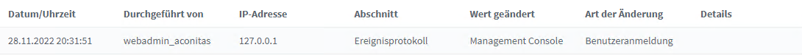
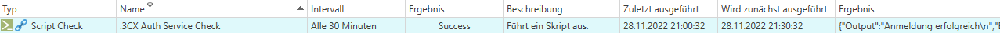

# 3CX Auth Service Check
Dieser Check für die Authentifizierung am 3CX Web Server für alle folgenden Checks durch. Er muss daher als erster Check eingerichtet werden und sollte im Intervall von 30 Minuten ausgeführt werden.
Die Authentifzierungsdaten werden als Parameter in der Riversuit angegeben
Weitere benötigte Daten für den Webserver werden über den installierten Agenten vom Skript automatisch aus der 3CX Datenbank bezogen.
Es werden keine weiteren Eingaben benötigt. Bei Verwendung des Auth Service Checks kann 2FA für die verwendete Nebenstelle nicht genutzt werden. Alternativ bietet sich die Token generierung via API an. 

Im Audit-Log der 3CX erscheint pro Anmeldung ein Eintrag von 127.0.0.1:

Output:

