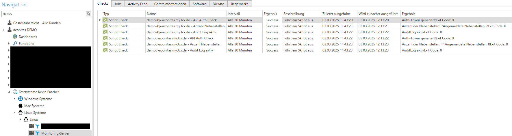

# Beschreibung

Die folgenden Skripte (Für 3CX V20) können für das Remote Monitoring der 3CX Instanz genutzt werden, wenn auf dem 3CX Server kein Remote Agent installiert ist. Für die Abfragen wir die 3CX API abgefragt. Somit können auch Hosted by 3CX Anlagen überwacht werden. 

# Voraussetzungen

Damit das Monitoring ausgeführt werden kann, wird ein Linux Server als Monitoring-Server benötigt. Dieser Server führt die Skripte entsprechend aus und führt API Anfragen durch. Hierfür kann eine kleine virtuelle Maschine auf Debian Basis verwendet werden. Auf dieser virtuellen Maschine muss der Riverbird Agent installiert werden, sodass dem Server Checks zugewiesen werden können. 

# Wichtige Informationen 

Die Checks müssen für jede zu überwachende 3CX Instanz angelegt werden. D.h. jeder 3CX Instanz benötigt ein eigenes Auth Skript ( API Auth oder PW Auth). Weiterführend muss in jedem Check die URL des 3CX Servers angegeben werden. So können mittels dem Monitoring Server mehrere 3CX Instanzen überwacht werden. 

Beispiel: 

